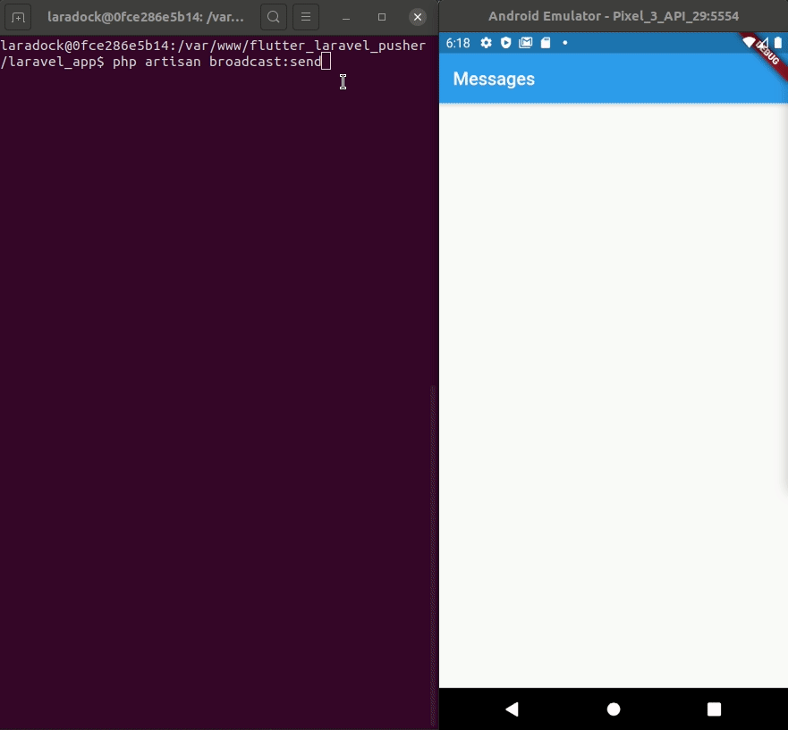
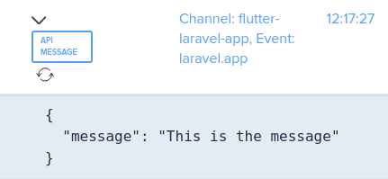
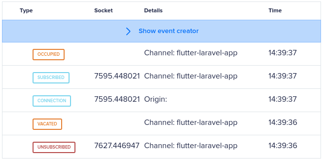
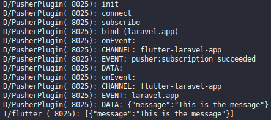

**Source Code**: https://github.com/maurobaptista/flutter-laravel-pusher

## Expected Result



## Setting up
This integration will use fresh installation of a Flutter project and, also, a fresh installation of a Laravel project, with some extra packages:

### Flutter

```bash
flutter create flutter_app
```

Packages:
- flutter_dotenv: ^2.1.0
- pusher_websocket_flutter: ^0.2.0

### Laravel

```bash
composer create-project --prefer-dist laravel/laravel laravel_app
```

Packages:
- pusher/pusher-php-server: ~4.0

### Pusher

You must have an account at https://pusher.com/

After you create your account, add a name (I'll use `flutter-laravel-app`), and choose you tech: `Android (java)` and `PHP`

On you channel overview, click in `App Keys`. On you Laravel .env file, add the keys information.
```
PUSHER_APP_ID={replace with the app_id}
PUSHER_APP_KEY={replace with the key}
PUSHER_APP_SECRET={replace with the secret}
PUSHER_APP_CLUSTER={replcae with the cluster you choose}
```

Also in the `.env` file, change the driver to broadcast:
```
BROADCAST_DRIVER=pusher
```

Now click and `Debug Console`, this is the interface where we will see wich message we are sending to flutter.

## Sending the request to Pusher (Laravel Side)

### Creating the trigger

For a matter to make it easy to trigger the event that will be broadcasted, We will set a command to do it.
```bash
php artisan make:command SendBroadcast
```

Inside the `app\Console\Commands\SendBroadcast` file, I will change the `$signature` and the `$desription` to:
```php
protected $signature = 'broadcast:send';

protected $description = 'Broadcast a message';
```

Add the code to handle the event, we are going to create the `SendMessage` class in the next step.
```php
public function handle()
{
    $message = $this->ask("Which message do you want to broadcast?");
    event(new \App\Events\SendMessage($message ?: 'No Message :)'));
}
```

This way we can call in our command line: `php artisan broadcast:send`

### Creating the event

```bash
php artisan make:event SendMessage
```

In the file `app/Events/SendMessage.php` we will make the class implement the `ShouldBroadcast`
```php
...

class SendMessage implements ShouldBroadcast
{
    ...
}
```

Now we need to set the attribute to send the message:
```php
/** @var string */
public $message;

/**
 * Create a new event instance.
 *
 * @return void
 */
public function __construct(string $message)
{
    $this->message = $message;
}
```

As we are setting the `$message` as public, Laravel will add the to the payload, as:
```php
[
    'message' => $message,
]
```

As we are going to broadcast to a public channel, we can return just the class `Channel`.
```php
public function broadcastOn()
{
    return new Channel('flutter-laravel-app');
}
```

### Test the broadcasting

Now you can run the command `php artisan broadcast:send`, and if all is working as expected, you should see it reflecting in the `Debug Console` in the pusher page.



### Retrieving the messages (Flutter)

#### Adding Network data

We will need to add a file in the folder `/android/app/src/main/res` called `network_security_config.xml` with the content:
```xml
<?xml version="1.0" encoding="utf-8"?>
<network-security-config>
    <base-config cleartextTrafficPermitted="true" />
</network-security-config>
```

If you do not do that you can face the error: `No Network Security Config specified, using platform default`

#### Setting the .env file

Inside your flutter project folder, add a file calle `.env`, and add the data on it
```
PUSHER_APP_ID=1030582
PUSHER_APP_KEY=93657c8aed66baf495f7
PUSHER_APP_SECRET=04b178b666ebea0f20b9
PUSHER_APP_CLUSTER=us2
```

Then add this file to your `pubspec.yaml` file.
```yaml
assets:
  - .env
``` 

Do not forget to add the `.env` file to your `.gitignore`

In the file `/lib/main.dart` add the DotEnv as a singleton. Below you can see the whole `main.dart` file, as we remove the boilerplater from it. The `MessageScreen` class will be created next.
```dart
import 'package:flutter/material.dart';
import 'package:flutter_dotenv/flutter_dotenv.dart';

import './screens/message_screen.dart';

Future main() async {
  await DotEnv().load('.env');

  runApp(MyApp());
}

class MyApp extends StatelessWidget {
  // This widget is the root of your application.
  @override
  Widget build(BuildContext context) {
    return MaterialApp(
      title: 'Flutter Demo',
      home: MessageScreen(),
    );
  }
}
```

#### Setting the Pusher

First create a new file `/lib/screens/message_screen.dart` and set it as a stateful widget. Note, that we are already importing the packages we are going to use, as `pusher` and `dotEnv`.
```dart
import 'package:flutter/material.dart';
import 'package:flutter_dotenv/flutter_dotenv.dart';
import 'package:pusher_websocket_flutter/pusher.dart';

class MessageScreen extends StatefulWidget {
  @override
  _MessageScreenState createState() => _MessageScreenState();
}

class _MessageScreenState extends State<MessageScreen> {
  @override
  Widget build(BuildContext context) {
    return Container();
  }
}
```

Now lets set the Pusher. We are going to call it in the `initState` method, as we need to star
```dart
class _MessageScreenState extends State<MessageScreen> {
  StreamController<String> _eventData = StreamController<String>();
  Sink get _inEventData => _eventData.sink;
  Stream get eventStream => _eventData.stream;

  Channel channel;

  String channelName = 'flutter-laravel-app';
  String eventName = 'laravel.app';

  List<String> messages = new List<String>();

  ...
  
  Future<void> initPusher() async {
    await Pusher.init(
        DotEnv().env['PUSHER_APP_KEY'],
        PusherOptions(cluster: DotEnv().env['PUSHER_APP_CLUSTER']),
        enableLogging: true
    );

    Pusher.connect();

    channel = await Pusher.subscribe(channelName);

    channel.bind(eventName, (last) {
      final String data = last.data;
      _inEventData.add(data);
    });

    eventStream.listen((data) async {
      messages.add(data);

      print(messages);
    });

  ...
}
```

First we are going to define the variables we are going to use:

The first three variable are going to handle the stream of new message coming in our app via the Pusher.
```dart
StreamController<String> _eventData = StreamController<String>();
Sink get _inEventData => _eventData.sink;
Stream get eventStream => _eventData.stream;
```

Then the `channel` variable will hold data from the Pusher channel.
```dart
Channel channel;
```

To make it easier to change the information we are going to store the channel name and the event name defined in Laravel in string variables. 
```dart
String channelName = 'flutter-laravel-app';
String eventName = 'laravel.app';
```

The last one is where we are going to store the messages we are receiving:
```dart
List<String> messages = new List<String>();
```

On the `initPusher` method we need to:

Init the Pusher package with data from our access key and the cluster we should connect, and then we are going to connect into Pusher via the `Pusher.connect()`:
```dart
await Pusher.init(
    DotEnv().env['PUSHER_APP_KEY'],
    PusherOptions(cluster: DotEnv().env['PUSHER_APP_CLUSTER']),
    enableLogging: true
);

Pusher.connect();
```

Then we must subscribe to our channel, and then bind the event to our streamer.
```dart
channel = await Pusher.subscribe(channelName);

channel.bind(eventName, (last) {
  final String data = last.data;
  _inEventData.add(data);
});
```

In the end we must listen to the stream and handle the data. For now, lets just add it to the messages list and then see it in flutter console.
```dart
eventStream.listen((data) async {
  messages.add(data);

  print(messages);
});
```

To make it work as expected, we must add it to the iniState():
```dart
class _MessageScreenState extends State<MessageScreen> {
  ... 
  
  @override
  void initState()
  {
    super.initState();

    initPusher();
  }

  ...
}
```

To avoid keep the connection with Pusher open, we must close it in the `dispose` method:
```dart
class _MessageScreenState extends State<MessageScreen> {
  ... 
  
  @override
  void dispose()
  {
    Pusher.unsubscribe(channelName);
    channel.unbind(eventName);
    _eventData.close();

    super.dispose();
  }

  ...
}
```

#### Let's check if it is working as expected

After you run you app, you should see something like that in your `Debug Console` in the Pusher dashboard:



Now run the `php artinan broadcast:send` and you should see the message in Flutter console.
 


### Improving the App view

#### Storing only the message

First, let's store in the message variable on the message and not the whole payload.

Add the `import 'dart:convert';` at the beginning of the file.

Then replace the listen callback to:
```dart
eventStream.listen((data) async {
  Map<String, dynamic> message = jsonDecode(data);

  setState(() {
    messages.add(message['message']);
  });
});
```

Note that we are storing the message inside the `setState`, so our app can be rebuild when we receive a new message.

#### Changing the view

Ok, now we can change our black app to show the messages we are receiving.
```dart
@override
Widget build(BuildContext context) {
return MaterialApp(
  title: 'Flutter + Laravel + Pusher',
  home: Scaffold(
    appBar: AppBar(
      title: Text('Messages'),
    ),
    body: ListView.builder(
      itemCount: messages.length,
      itemBuilder: (BuildContext context, int index) {
        return Container(
          margin: EdgeInsets.all(15),
          child: Center(
            child: Text(
              messages[index],
              style: TextStyle(
                fontSize: 20,
                fontWeight: FontWeight.bold,
              ),
            ),
          ),
        );
      }
    )
  ),
);
```

You have some other way to approach that, as a StreamBuilder (which I believe would be cleaner), but here is just to see how to create the backend (Laravel) and the FrontEnd (Flutter) to load pusher messages.