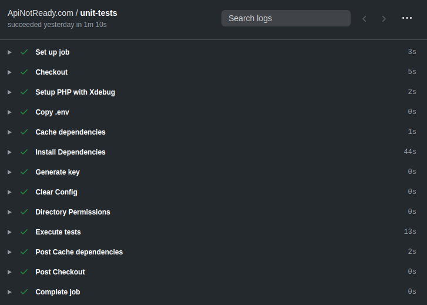

## Expected Result

This Github Action is used in https://apinotready.com



### Whole Github Action

If you don't want to go further, and just want the action itself. Feel free :)

```yaml
name: ApiNotReady.com

on: [push, pull_request]

jobs:
  unit-tests:
    runs-on: ubuntu-latest
    steps:
      - name: Checkout
        uses: actions/checkout@v2

      - name: Setup PHP with Xdebug
        uses: shivammathur/setup-php@v2
        with:
          php-version: '7.4'
          coverage: xdebug

      - name: Copy .env
        run: php -r "file_exists('.env') || copy('.env.example', '.env');"

      - name: Cache dependencies
        uses: actions/cache@v2
        with:
          path: ~/.composer/cache/files
          key: dependencies-composer-${{ hashFiles('composer.json') }}

      - name: Install Dependencies
        run: composer install -q --no-ansi --no-interaction --no-progress --prefer-dist --optimize-autoloader

      - name: Generate key
        run: php artisan key:generate

      - name: Clear Config
        run: php artisan config:clear

      - name: Directory Permissions
        run: chmod -R 777 storage bootstrap/cache

      - name: Execute tests
        run: vendor/bin/pest --coverage --min=90
```

### Default from Github

The default action to Laravel from Github only comes with the `uses: actions/checkout@v2`, but, as we are going to use the coverage from Pest php, we will need to set xdebug, as well.

This is the reason we need to add:
```yaml
- name: Setup PHP with Xdebug
  uses: shivammathur/setup-php@v2
  with:
    php-version: '7.4'
    coverage: xdebug
```

### Error with PHPUnit

When using the default action from Github action, you will receive the following error:

```bash
option --coverage is ambiguous
```

The issue here is the `--no-script` when running composer install. You must remove this argument when running it.

### Setting minimun coverage

As you can find in Pest documentation, you must add the following arguments when you run the tests:
```yaml
- name: Execute tests
  run: vendor/bin/pest --coverage --min=90
``` 