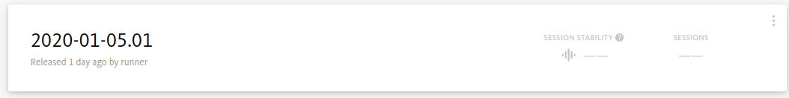
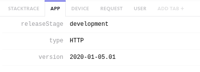

## Expected Result

In Bugsnag, I expect to see a new release information based on my release tag:



This information will help me to debug it, as this information is now seen in the logs:



---

### Important Note

I just made it as a proof of concept, and I added it to a side project with no relevance at all. I really believe you shouldn't update you .env file on the fly, as it brings more risks then benefits.

---

### On Github Actions

I've added at the bottom of my Github Actions the curl to send the request to Forge provide the release, and also the information to notify bugsnag about the new release. So far so good, nothing risky at all! :)

```php
name: Release

on:
  create:
    tags:
      - '*'

jobs:
  release:
    runs-on: ubuntu-latest

    steps:
      
      ... steps hidden

      - name: Deploy to Laravel Forge
        run: curl ${{ secrets.FORGE_DEPLOY_WEBHOOK }}

      - name: Send deploy data to Bugsnag
        env:
          APP_ENV: production
          BUGSNAG_API_KEY: ${{ secrets.BUGSNAG_API_KEY }}
          BUGSNAG_APP_VERSION: ${{ steps.get_version.outputs.VERSION }}
        run: php artisan bugsnag:deploy --revision "$GITHUB_SHA"
```

---

### Command to update App Version for Bugsnag

Ok, now we start with the bad ideas.

This is the command where I update the BUGSNAG_APP_VERSION on the .env file, I'm going to call this command in the Forge release, so we can replace the environment variable about the app version to the new tag. 

If we don't do that, our application will not send any information (or worst, will send an outdated information) to bugsnag.

```php
namespace App\Console\Commands;

use Illuminate\Console\Command;

class BugsnagVersionReplace extends Command
{
  protected $signature = 'bugsnag:version-replace {version}';

  protected $description = 'Replace the Bugsnag App Version in .env';

  public function handle()
  {
    $envFile = base_path('.env');
    $envFileContent = file_get_contents($envFile);

    $oldValue = 'BUGSNAG_APP_VERSION=' . env('BUGSNAG_APP_VERSION');
    $newValue = 'BUGSNAG_APP_VERSION=' . $this->argument('version');

    file_put_contents($envFile, str_replace($oldValue, $newValue, $envFileContent));
  }
}
```

As you can see, notg fancy at all. Just a simple read the file, replace content, and save again.

You will need to add the `BUGSNAG_APP_VERSION` on your .env before running that.

---

### Laravel Forge

```bash
cd /home/forge/myfolder # You shouldn't change the first row

git pull origin master --tags # Added the tags here, as we consider it our version

$FORGE_COMPOSER install --no-interaction --prefer-dist --optimize-autoloader # No change in this line

export TAG=$(git describe --tags `git rev-list --tags --max-count=1`) # Extract tag from git information

php artisan bugsnag:version-replace $TAG # Command to replace the environment variable with the recent pulled tag

# No changes in the composer and after that
```